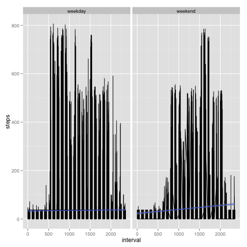

# Reproducible Research: Peer Assessment 1
========================================================
##Packages
#### timeDate, ggplot2

## Loading and preprocessing the data

```r
library(timeDate)
library(ggplot2)
#Download the Activity monitoring Data
temp <- tempfile()
download.file("https://d396qusza40orc.cloudfront.net/repdata%2Fdata%2Factivity.zip",method="curl",temp)
data <- read.csv(unz(temp, "activity.csv"))
unlink(temp)
```

## Total number of steps taken per day

```r
#Create a histogram of the total number of steps taken each day
hist(data$steps)
```

 

```r
#To get the mean and the median
summary(data$steps)
```

```
##    Min. 1st Qu.  Median    Mean 3rd Qu.    Max.    NA's 
##     0.0     0.0     0.0    37.4    12.0   806.0    2304
```

## average daily activity pattern

```r
plot(data$interval, data$steps, type='l')
```

 

```r
#5-minute interval with the highest steps
bad <- is.na(data$steps)
data$interval[max(data$steps[!bad])]
```

```
## [1] 1905
```

## Imputing missing values

```r
#total number of missing values
total_missing <- sum(is.na(data$steps))
#To fill NAs with the total mean
total_mean <- mean(data$steps[!bad])
#New DS with no missing values
newDS <- data
newDS$steps[is.na(data$steps)] <- total_mean
#A new histogram
hist(newDS$steps)
```

 

```r
#And the mean and the median
summary(newDS$steps)
```

```
##    Min. 1st Qu.  Median    Mean 3rd Qu.    Max. 
##     0.0     0.0     0.0    37.4    37.4   806.0
```

```r
#... AS I use the median the results are the same on estimating the TOTAL number of steps
#Although there is a lot of false data now. Can cause problems to reports for short time.
```

## Differences in activity patterns between weekdays and weekends

```r
#Get the week days and assign weekday and weekand
newDS$day <- weekdays(as.Date(newDS$date))
newDS$weekst <- isWeekday(as.Date(newDS$date))
newDS$weekst[newDS$weekst == TRUE] <- "weekday"
newDS$weekst[newDS$weekst == FALSE] <- "weekend"
#Get the column mean and make the plot
mean_steps <- colMeans(matrix(newDS$steps,))
qplot(interval, steps, data= newDS,  facets = . ~weekst, geom = c("line", "smooth"), method="lm")
```

 


